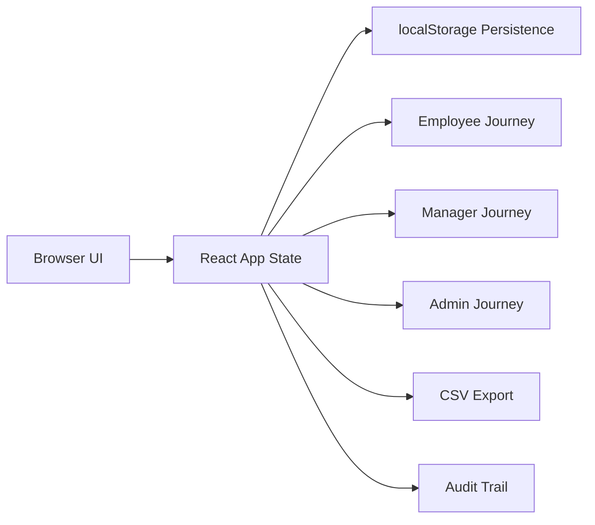

<<<<<<< HEAD
# Atomquest Goal Portal

Functional demo portal for employee goal setting, manager approvals, quarterly check-ins, shared KPI sync, reporting, and audit trail management.

The app now starts with a login screen. Use employee sign-up to create new accounts, and sign in with the seeded manager credentials below.

## What It Covers

- Employee goal creation, inline editing before submission, and BRD validation for total weightage, minimum weightage, and goal count.
- Manager approval workflow with inline edits, return for rework, and lock-on-approval behavior.
- Quarterly achievement capture with planned vs actual tracking and status updates.
- Shared goals pushed across multiple employees with synchronized achievement updates.
- Admin controls for cycle simulation, unlock actions, completion visibility, audit trail review, and CSV export.

## Run Locally

```bash
npm install
npm run dev
```

## Build

```bash
npm run build
```

## Demo Roles

- Employee: Alice Chen
- Manager: Maya Patel
- Admin: Nora Hughes

## Login Details

- Manager email: sk.39648215@gmail.com
- Manager employee ID: 1301
- Manager password: Sachin1301
- New employees must sign up with email, password, and the correct manager employee ID.

Use the role switcher in the left sidebar to move between journeys.

## Architecture



## Notes

- The demo uses seeded data and browser persistence instead of a backend to keep the hackathon delivery lightweight.
- The quarter window can be simulated from the Admin date picker.
=======
# Atomquest
>>>>>>> bb3e375fa2417fd6cea3a83fa72cc54591c47750
